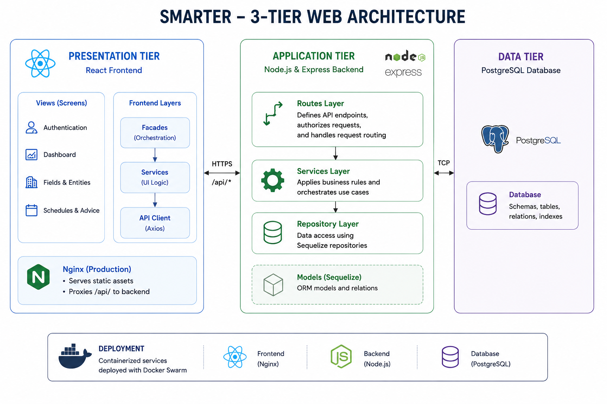

# Watering WebApp

Web application for the **SMARTER** soil monitoring and prescriptive irrigation
system, a precision farming platform for orchard irrigation management.

This repository contains the backend, the deployment assets, and a frontend
submodule.

## Architecture

SMARTER is a 3-tier web platform with a containerized deployment architecture. The platform is composed of three main layers: the presentation tier, the application tier, and the data tier.

- The presentation tier is the React frontend.
- The application tier is the Node.js and Express backend.
- The data tier is the PostgreSQL database accessed through Sequelize.
- The `smarter-charts` external library provides the domain-specific visual components used in the dashboard.
- The deploy scripts build container images and publish them through Docker Swarm.

The production image for the frontend serves the built assets with Nginx and
proxies `/api/` traffic to the backend service, which keeps the browser-facing
entrypoint simple while still separating static content from API handling.



### Design Notes

The repository is structured to ensure a clear separation of concerns, with each major responsibility isolated in its own module. The backend layers are organized around core domain concerns, aligning the structure with the underlying business logic.

- `backend/application/src/app.js` bootstraps the application, configures middleware, and mounts all route groups.
- `backend/application/src/routes/` defines the public API surface.
- `backend/application/src/services/` contains application and domain logic, kept independent from HTTP concerns.
- `backend/application/src/persistence/` encapsulates Sequelize models and repositories, isolating database access details.
- `frontend/SMARTER-frontend/src/views/` contains page-level views, while `src/api/`, `src/services/`, and `src/facades/` separate API access, business logic, and orchestration concerns on the client side.
- `frontend/SMARTER-frontend/src/App.tsx` acts as the root application component, responsible for routing, authentication, language selection, and chart registration.

### Data And UI Flow

The backend is the center of the system flow. Most interactions follow the same
pattern:

1. The frontend sends a request through the shared Axios client with the bearer token.
2. The backend authenticates the request and validates the user permissions.
3. The route layer selects the correct service for the use case.
4. The service layer applies the business rules for companies, farms, sectors, theses, devices, signals, schedules, or logs.
5. The repository layer reads from or writes to PostgreSQL through Sequelize models.
6. The backend returns a DTO-shaped response that the frontend can render directly.

This design keeps the client layer lightweight while centralizing validation, authorization, and business logic in the backend, where it can be managed consistently.

The UI is organized around a set of domain-driven workflows that are directly driven by backend responses:

- authentication and session management;
- dashboard views for sensor data exploration;
- field and entity management;
- watering advice management;

This keeps the browser thin and pushes the important decisions into the backend, where validation, authorization, and domain rules can be kept in one place.


For dashboard visualization, charts used in the frontend exploits the `smarter-charts` custom elements registered once at
startup and then rendered inside the views. The chart components
receive the backend data they need through the API payloads, so the dashboard
mostly becomes a composition layer over the domain services exposed by the
backend.

### Application Logic
The backend concentrates the main application logic of SMARTER and organizes it around the platform’s core domain workflows. It handles user authentication and authorization, company and organization management, farm and field setup, device registration and assignment, signal ingestion and retrieval, and the generation of watering events. A key part of this logic is the watering advice simulator, where the backend evaluates the available field data, soil conditions, and thesis-related parameters to produce irrigation recommendations that can be displayed in the frontend or used in downstream workflows to schedule valves. The backend also manages service enablement for sectors, user permissions, and the data used by the dashboard charts, so the frontend mainly acts as a presentation layer over these domain services.

## Repository Layout

- `backend/application`: Node.js and Express REST API.
- `frontend/SMARTER-frontend`: React, TypeScript and Vite frontend submodule.
- `docker-compose.yaml`: Swarm stack definition for deployment.
- `deploy.sh`: helper script that builds the images and deploys the stack.

The frontend has its own documentation in
[`frontend/SMARTER-frontend/README.md`](./frontend/SMARTER-frontend/README.md).

## Getting Started

Clone the repository with the submodule, or initialize it after cloning:

```sh
git clone --recurse-submodules <repo-url>
# or

git submodule update --init --recursive
```

## Backend Structure

The backend lives in `backend/application` and is organized as follows:

- `src/app.js`: Express app setup, routers, services and middleware.
- `src/server.js`: application entrypoint.
- `src/routes/`: HTTP route definitions.
- `src/services/`: business logic.
- `src/persistency/`: Sequelize models and repositories.
- `src/dtos/`: request and response DTOs.
- `src/configs/`: database configuration.
- `src/commons/`: shared helpers.
- `doc/`: OpenAPI YAML files.
- `tests/`: Vitest integration tests.

Swagger UI is available at `/api-docs`.

## Environment Files

Create local `.env` files from the examples before running the project.

Backend environment variables are defined in `backend/application/.env.example`.

The frontend submodule environment variables are presented in `frontend/SMARTER-frontend/.env.example`.

## Develop Locally

Backend:

```sh
cd backend/application
npm install
npm run start
```

Frontend:

```sh
cd frontend/SMARTER-frontend
npm install
npm run dev
```

Backend tests:

```sh
cd backend/application
npm test
```

The backend tests use Vitest and Testcontainers, so Docker must be running.

## Deploy

The repo is deployed through Docker images and Docker Swarm.

1. Build and push the backend image:

```sh
cd backend
./build_image.sh smarter-web-backend 0.9.0
```

2. Build and push the frontend image:

```sh
cd frontend
./build_image.sh smarter-web-frontend 0.9.0
```

3. Deploy the stack from the repository root:

```sh
./deploy.sh
```

The stack exposes:
- Frontend on host port `43080`.
- Backend on host port `8081`.

The frontend container serves the static build through Nginx and proxies `/api/`
requests to the backend service.

## Deploy and run a local demo version

```bash
./run-demo.sh
```